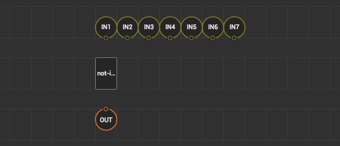
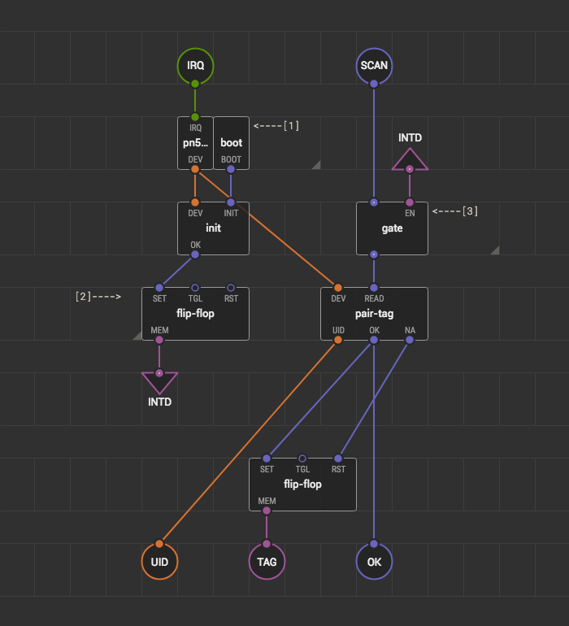

# Создание оберток объектных Arduino-библиотек

Для Arduino написано уже множество библиотек и их можно подключать в XOD и
использовать всю мощь существующей экосистемы.

Чтобы понять это руководство, вы должны знать как работать с
[кастомными типами](../custom-types/) и как писать
[C++ код в XOD](../nodes-for-xod-in-cpp/), и иметь хотя бы небольшой опыт
работы с C++ библиотеками.

Представим, что мы хотим чтобы наша плата Arduino включала или выключала
built-in светодиод, когда мы подносим к ней NFC-метку (наш проездной, например).

Давайте представим, что у нас нет XOD-библиотеки для работы с RFID/NFC сканером
PN532 (`xod-dev/pn532-nfc`) и попробуем ее сделать. Чтобы не вдаваться в
подробности работы с метками мы возьмем Arduino-библиотеку
[Adafruit-PN532](https://github.com/adafruit/Adafruit-PN532) и просто обернем ее
в XOD ноды.

Для этого нам потребуется:

1.  Объявить новый кастомный тип `pn532-device`, который описывает RFID/NFC
    модуль и как он подключен к Arduino. Экземпляров такой ноды может быть
    много, по одному экземпляру на каждый физический модуль.
2.  Заявить зависимость от сторонней C++ библиотеки, чтобы XOD знал откуда её
    можно скачать и пользователям библиотеки не пришлось бы делать это вручную
3.  Создать ноды-действия для этого типа, которые соответствуют тем функциям и
    методам, которые предоставляет сторонняя C++ библиотека.
4.  Создать упрощенную ноду чтения метки, для быстрого решения наиболее частых
    задач, стоящих перед RFID/NFC сканером.
5.  Создать несколько патчей-примеров.

## Создаем девайс и подключаем библиотеку

Давайте взглянем на библиотеку от Adafruit. И в первую очередь нас интересуют
конструкторы класса:

```cpp
class Adafruit_PN532{
    public:
        // Software SPI
        Adafruit_PN532(uint8_t clk, uint8_t miso, uint8_t mosi, uint8_t ss);
        // Hardware I2C
        Adafruit_PN532(uint8_t irq, uint8_t reset);
        // Hardware SPI
        Adafruit_PN532(uint8_t ss);
        // …
};
```

Она имеет три конструктора для разных способов подключения: HardwareSPI,
HardwareI2C и SoftwareSPI. Давайте остановимся на втором варианте и создадим
девайс для этого типа подключения:

1.  Создадим новый патч "pn532-device". Название патча станет названием нового
    кастомного типа, который мы будем передавать в ноды-действия. Обратите
    внимание на **device** в названии. По конвенции, любые ноды, которые создают
    новый тип данных для работы с устройствами, мы называем `xxx-device`.
2.  Поставим ноду `not-implemented-in-xod`, т.к. нам потребуется создать
    экземпляр класса из C++ библиотеки.
3.  Поставим ноду `output-self`, задав ей label: `DEV` Благодаря этому особому
    терминалу мы объявим [кастомный тип](../custom-types/).
4.  Поставим один терминал `input-port` для указания порта прерывания: `IRQ`.
    Это один из двух портов требуемых в конструкторе класса. По нему модуль
    будет сообщать Arduino что обнаружена карта. Второй пин (reset) нам не
    потребуется, т.к. Он нужен для перезагрузки модуля в случае если вы
    работаете с ним на низком уровне и что-то сделали не так. За нас все это
    делает проверенная библиотека, так что перезагружать модуль нам не придется.

Откроем редактор C++ кода и напишем на первой строчке:

```cpp
#pragma XOD require "https://github.com/adafruit/Adafruit-PN532"
```

<div class="ui segment note">
<span class="ui ribbon label">Note</span>

В данный момент подключение сторонних библиотек возможно только с GitHub из
master-ветки. Если вы хотите подключить библиотеку из другой ветки или с
правками — сделайте fork и подключайте его.

</div>

Это особая строка, сообщающая XOD-у, что этой ноде потребуется сторонняя C++
библиотека. При первой же компиляции XOD проверит ее наличие в вашем workspace и
если не найдет ее, то предложит скачать и установить ее просто нажав на кнопку в
самой IDE.

<div class="ui segment note">
<span class="ui ribbon label">Note</span>

После установки нужно будет запустить компиляцию еще раз.

</div>

Таким образом мы установим библиотеку и теперь сможем ей пользоваться. Давайте
подключим её и создадим экземпляр класса:

```cpp
// Укажем откуда взять библиотеку:
#pragma XOD require "https://github.com/adafruit/Adafruit-PN532"

// Подключим библиотеку в наш код:
\{{#global}}
#include <Adafruit_PN532.h>
\{{/global}}

struct State {
    // Класс Adafruit_PN532 требует указать пины подключения в момент
    // создания экземпляра класса, но они нам пока что неизвестны.
    // Поэтому зарезервируем память для хранения экземпляра класса,
    // а создадим его позже:
    uint8_t mem[sizeof(Adafruit_PN532)];
};

// Обозначаем наш кастомный тип как указатель на экземпляр класса
using Type = Adafruit_PN532*;

\{{ GENERATED_CODE }}

void evaluate(Context ctx) {
    // Функция должна исполниться один раз на первой (setup) транзакции
    if (!isSettingUp())
        return;

    auto state = getState(ctx);
    auto irq = getValue<input_IRQ>(ctx);

    // Создаем экземпляр класса с указанием заранее заготовленного места
    // для его хранения с помощью указателя в скобках
    // Вместо порта `reset` укажем `NOT_A_PORT`, т.к. в штатном режиме
    // работы он не нужен
    Type nfc = new (state->mem) Adafruit_PN532(irq, NOT_A_PORT);

    emitValue<output_DEV>(ctx, nfc);
}
```

Мы подключили библиотеку и создали экземпляр класса. Осталось инициализировать
NFC сканер и начать работать с ним. Для этого нам потребуется создать
ноды-действия. Приступим.

## Ноды-действия

Чтобы работать с экземпляром класса в XOD мы должны обернуть вызовы его методов
в ноды, а сам класс, с которым предстоит работать, передавать в виде созданного
нами кастомного типа. Таким образом, любая нода-действие для этой библиотеки
будет содержать вход типа `pn532-device`.

Методы класса могут совершать различные сайд-эффекты (общаение с железкой) и
быть асинхронными. Это значит, что наша программа не должна остановиться и ждать
пока этот сайд-эффект не будет выполнен. Поэтому для каждого такого действия нам
потребуются еще pulse терминалы, для запуска действия и для оповещении о
завершении, успешном или провальном.

Для нашей задачи нам потребуется создать две ноды-действия:

1.  `init` — инициализирует работу модуля
2.  `pair-tag` — обнаружит метку и считает ее UID

<div class="ui segment note">
<span class="ui ribbon label">Note</span>
Обратите внимание, что названия нод-действий начинаются с глаголов. По конвенции,
любые ноды, которые передают инструкции что делать в императивном виде, должны
начинаться с глагола (`init`, `read-byte`, `read-uid`, `write-line` и т.п.).
</div>

### Создадим ноду `init`

Давайте начнем с создания ноды, которая инициализирует работу NFC сканера.


Перейдем к C++:

```cpp
struct State {
};

\{{ GENERATED_CODE }}

void evaluate(Context ctx) {
    // Нода реагирует только если есть входной пульс
    if (!isInputDirty<input_INIT>(ctx))
        return;

    // Таким образом мы получаем тот самый кастомный тип, который мы
    // создавали на предыдущем шаге.
    // То есть указатель на экземпляр класса `Adafruit_PN532`.
    auto nfc = getValue<input_DEV>(ctx);

    // Инициализируем RFID/NFC сканер
    nfc->begin();

    uint32_t versiondata = nfc->getFirmwareVersion();
    if (!versiondata) {
      // Если плата не ответила своей версией —
      // ошибка подключения или что-то не то с платой
      emitValue<output_ERR>(ctx, 1);
      return;
    }

    // Установим максимальное количество попыток прочтения карты в 1
    // Таким образом исполнение нашей программы не будет блокировано
    // бесконечными или долгими множественными попытками прочитать
    // или хотя бы обнаружить карту.
    nfc->setPassiveActivationRetries(1);

    // Сконфигурируем модуль для чтения RFID меток
    nfc->SAMConfig();

    // Передаем пульс об успехе
    emitValue<output_OK>(ctx, 1);
}
```

Теперь мы можем инициализировать работу NFC сканера. Далее мы подготовим все для
чтения UID и его сравнения с нашей меткой, а затем создадим ноду для чтения
метки.

<div class="ui segment note">
<span class="ui ribbon label">Note</span>

Не забывайте давать терминалам и патчам [описание](../documenting-nodes/).

</div>

### Хранение и сравнение UID

Т.к. UID метки это набор байтов, который по спецификации ISO14443A может быть
размером от 4 до 10 байт для разных типов карт и разных видов UID (Single size
UID, Double size UID, Triple size UID, RUID, NUID, FNUID), то для надежности
давайте упакуем это значение в специальный тип данных, который мы сейчас
создадим.

Создадим патч `nfc-uid`: 

Обратите внимание, что здесь у нас есть 7 входов типа `byte`, чтобы мы могли
вручную задать UID нашей метки. Это нам пригодится далее, когда мы будем
сравнивать UID прочитанной карты с UID нашей карты активации.

Перейдем к коду:

```cpp
struct State {
};

// Объявим наш кастомный тип как структуру,
// в которой будем хранить массив байт
struct Type {
    uint8_t items[7];
};

\{{ GENERATED_CODE }}

void evaluate(Context ctx) {
    auto state = getState(ctx);

    Type uid;
    // Кладем каждое значение со входа в наш массив байт
    uid.items[0] = (uint8_t)getValue<input_IN1>(ctx);
    uid.items[1] = (uint8_t)getValue<input_IN2>(ctx);
    uid.items[2] = (uint8_t)getValue<input_IN3>(ctx);
    uid.items[3] = (uint8_t)getValue<input_IN4>(ctx);
    uid.items[4] = (uint8_t)getValue<input_IN5>(ctx);
    uid.items[5] = (uint8_t)getValue<input_IN6>(ctx);
    uid.items[6] = (uint8_t)getValue<input_IN7>(ctx);

    emitValue<output_OUT>(ctx, uid);
}
```

По подобию мы можем сделать ноду, которая "развернет" UID на набор байтов с
семью выходами снизу (`unpack-nfc-uid` отличное название для нее). Это может
быть полезно если мы захотим сравнивать, например, конкретные байты после
прочтения карты. Так, например, Double size UID содержит ID производителя на 0
позиции.

Для нашей задачи важно сравнить UID поднесенной метки с UID нашей метки (мы ведь
не хотим чтобы кто попало включал и выключал наш светодиод). Давайте создадим
ноду `equal(nfc-uid)`. Обратите внимание, что в скбоках мы указали наш тип
данных, это будет
[специализация](../creating-generics/#specialization-patches) именно для
сравнения UID. Таким образом пользователь сможет не задумываться и использовать
привычную ноду `xod/core/equal` для сравнения UID меток.


Для сравнения двух массивов мы воспользуемся встроенной функцией `memcmp`:

```cpp
struct State {
};

\{{ GENERATED_CODE }}

void evaluate(Context ctx) {
    auto uidA = getValue<input_IN1>(ctx);
    auto uidB = getValue<input_IN2>(ctx);

    // Функция `memcmp` сравнивает данные по двум указателям
    // и возвращает `0` если они равны
    bool eq = memcmp(uidA.items, uidB.items, sizeof(uidA.items)) == 0;

    emitValue<output_OUT>(ctx, eq);
}
```

Давайте проверим что все работает и заодно создадим демонстрационный патч:
`example-uid-equals`.


Теперь мы можем создавать и хранить UID и сравнивать их между собой. Пришло
время прочитать UID нашей NFC-метки.

### Создадим ноду `pair-tag`

Для того чтобы взаимодействовать с метками — нужно сначала обнаружить карту и
прочитать её UID. Именно поэтому нода называется не `read-uid`, а `pair-tag`.


Перейдем к C++:

```cpp
struct State {
};

\{{ GENERATED_CODE }}

void evaluate(Context ctx) {
    if (!isInputDirty<input_READ>(ctx))
        return;

    auto nfc = getValue<input_DEV>(ctx);

    // Создадим переменную нужного нам типа, взяв тип от выходного терминала
    ValueType<output_UID>::T uid;
    // Создадим переменную для хранения длины UID
    uint8_t uidLength;

    // Обнулим UID
    memset(uid.items, 0, sizeof(uid));
    // Находим метку и читаем ее UID
    bool res = nfc->readPassiveTargetID(
      PN532_MIFARE_ISO14443A,
      uid.items,
      &uidLength
    );

    if (res) {
        // Передадим UID в терминал и оповестим об успехе
        emitValue<output_UID>(ctx, uid);
        emitValue<output_OK>(ctx, 1);
    } else {
        emitValue<output_ERR>(ctx, 1);
    }
}
```

Всё готово чтобы считать UID метки. Но на самом деле библиотека от Adafruit
позволяет нам читать не только UID метки, но и считывать и записывать данные на
метку. И если вы делаете обертку над библиотекой, то мы рекомендуем обернуть
хотя бы самые распространенные методы, чтобы избежать появления множества
оберток над одной и той же библиотекой, которые имеют только ограниченный набор
возможностей.

Попробуйте самостоятельно сделать ноды `read-page` и `write-page`, используя
методы `mifareultralight_ReadPage` и `mifareultralight_WritePage` из библиотеки
Adafruit. И сделайте example patch, на котором будете считать количество
прикладываний метки, сохраняя его на самой метке (для работы с этими методами
вам потребуются метки Mifare Ultralight).

## Быстрая нода

На этом мы могли бы закончить. Но давайте сделаем еще одну вещь: быструю ноду.
Представьте, что эту библиотеку делал кто-то другой, а вы хотите ей лишь
воспользоваться. Удобно ли вам было бы использовать целую цепочку из нод
`pn532-device`, `init`, `read-uid`, чтобы просто узнать поднесена ли к модулю
NFC-метка?

Давайте упростим жизнь и себе, и потребителям библиотеки, и напишем простой
`nfc-scanner`, который решит большинство простых задач с помощью всего одной
ноды. Такие ноды называются быстрыми (quick start nodes).



1.  Инициализируем RFID/NFC модуль на старте;
2.  Когда модуль будет иницализирован `flip-flop` откроет `gate`;
3.  `gate` защитит нас от попыток обнаружить NFC тэг до тех пор, пока модуль не
    будет инициализирован.

Теперь сделаем наш `example-nfc-scanner`:


<div class="ui segment note">
<span class="ui ribbon label">Note</span>

Создание патчей-примеров в рамках библиотеки это отличная практика. Она
позволяет сразу же проверить работоспособность библиотеки, проверить удобство ее
использования и в будущем станет отличным примером как пользоваться библиотекой.

</div>

Всё готово и работает!

## Подведем итог

1.  Чтобы подключить стороннюю библиотеку, укажите в коде специальную
    pragma-инструкцию: `#pragma XOR require "https://github.com/some/library"`
2.  Кроме указания откуда взять библиотеку, нужно не забыть подключить ее в
    коде:

    ```cpp
        \{{#global}}
        #include <SomeLibrary.h>
        \{{/global}}
```

4.  Оборачивая методы в ноды используйте в их названии глаголы (`pair-tag`,
    `write-page`).
5.  Создавайте простые патч-ноды для быстрого решения стандартных задач
    (`nfc-scanner`, `nfc-writer`)

Теперь осталось
[добавить описание проекта и поделиться им](../creating-libraries/) с
сообществом.
